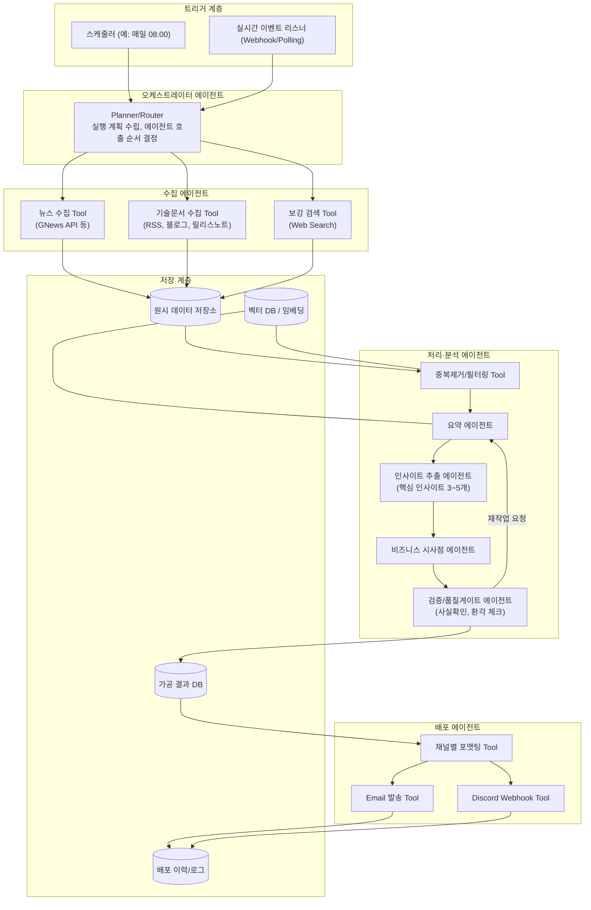

# 뉴스·기술문서 수집 → LLM 요약/인사이트 → 배포 에이전틱 AI 시스템 설계

## 1. 목표

GNews 등 실시간 뉴스와 빅테크 기술문서(블로그, 릴리스노트, 논문 등)를 자동으로 수집하고, LLM 에이전트가 tool을 사용해 정보를 가공(요약, 핵심 인사이트 3~5개, 비즈니스 시사점 도출)한 뒤 이메일과 Discord로 배포하는 시스템이다. 정기 배치 배포와 긴급 이슈에 대한 실시간 알림을 모두 지원하는 하이브리드 실행을 전제로 설계한다. 특정 프레임워크(LangGraph, CrewAI 등)에 종속되지 않는 범용 아키텍처로 구성해, 이후 원하는 프레임워크나 Claude Agent SDK로 자유롭게 구현할 수 있도록 한다.

## 2. 전체 아키텍처 개요

시스템은 크게 다섯 계층으로 나뉜다: 트리거 계층이 배치 스케줄과 실시간 이벤트를 감지해 파이프라인을 기동하고, 오케스트레이터 에이전트가 전체 실행을 계획·조정하며, 수집 에이전트가 외부 소스에서 원시 데이터를 가져오고, 처리 에이전트가 이를 요약·분석해 구조화된 인사이트로 변환하고, 마지막으로 배포 에이전트가 채널별 포맷으로 가공해 발송한다. 모든 단계의 중간 산출물은 저장 계층에 기록되어 재실행, 감사, 중복 제거의 기준이 된다.



## 3. 계층별 상세 설계

### 3.1 트리거 계층 (하이브리드 실행)

정기 배치는 크론 스케줄러가 담당한다. 예를 들어 매일 아침 지정 시각에 지난 24시간치 뉴스·기술문서를 모아 다이제스트를 발송하는 식이다. 실시간 트리거는 GNews의 폴링 주기를 짧게(예: 15~30분) 두거나, 특정 키워드·소스에 대한 웹훅/RSS 변경 감지를 걸어 긴급도가 높은 이슈(예: 빅테크의 주요 모델 출시, 대형 장애, M&A)가 발생하면 별도의 경량 파이프라인이 즉시 발동하도록 한다. 두 트리거는 동일한 오케스트레이터에 진입하되, 실시간 경로는 처리 단계를 간소화(속보 요약 1~2문장 + 원문 링크)해 응답 속도를 확보하고, 배치 경로는 전체 파이프라인(요약→인사이트→시사점→검증)을 거치는 것으로 구분한다.

### 3.2 오케스트레이터 에이전트

전체 실행의 계획자 역할을 하는 에이전트다. 트리거 종류(배치/실시간), 대상 소스 목록, 처리 깊이를 판단해 어떤 하위 에이전트/tool을 어떤 순서로 호출할지 결정한다. 실패나 재시도, 하위 에이전트 간 데이터 전달(핸드오프)도 이 계층에서 관리한다. 프레임워크에 따라 그래프 기반 상태머신(LangGraph류)으로 구현할 수도 있고, 단일 에이전트의 tool-use 루프(Claude 등)로 구현할 수도 있다.

### 3.3 수집 에이전트와 도구(Tool)

수집 에이전트는 오케스트레이터의 지시에 따라 아래 tool들을 호출해 원시 데이터를 가져온다. 뉴스 수집 tool은 GNews API 등을 감싸 키워드, 카테고리, 기간 조건으로 기사 목록(제목, 요약, 본문 URL, 발행일, 출처)을 반환한다. 기술문서 수집 tool은 주요 빅테크(OpenAI, Anthropic, Google, Meta, Microsoft 등)의 블로그/릴리스노트 RSS나 문서 페이지를 크롤링해 신규 게시물을 가져온다. 보강 검색 tool은 특정 사건의 배경이나 추가 맥락이 필요할 때 웹 검색으로 보완 정보를 가져오는 용도로, 항상 실행되기보다 검증 단계에서 필요 시 호출되는 선택적 tool로 둔다.

### 3.4 처리·분석 에이전트

원시 데이터는 우선 중복제거/필터링 tool을 거친다. 동일 사건을 다룬 여러 기사를 임베딩 유사도로 클러스터링해 대표 기사만 남기고, 사전에 정의한 관심 주제(예: LLM, 반도체, 클라우드, 특정 기업)에 맞지 않는 항목은 걸러낸다. 이후 요약 에이전트가 각 클러스터를 200~300자 내외로 요약하고, 인사이트 추출 에이전트가 여러 요약을 종합해 핵심 인사이트 3~5개를 뽑아낸다. 비즈니스 시사점 에이전트는 이 인사이트를 바탕으로 "우리 조직/업계에 무엇을 의미하는가"를 문장으로 정리한다. 이 세 에이전트는 하나의 프롬프트 체인으로 합칠 수도 있지만, 역할을 분리하면 각 단계의 출력을 독립적으로 검증하고 재시도할 수 있어 품질 관리가 쉬워진다.

### 3.5 검증/품질게이트 에이전트

LLM 산출물을 그대로 배포하면 환각이나 원문 왜곡 위험이 있으므로, 검증 에이전트가 인사이트/시사점이 원문 근거와 실제로 연결되는지 대조한다. 구체적으로는 각 인사이트에 원문 인용/링크를 강제로 첨부하게 하고, 검증 에이전트가 인용된 원문에 실제로 해당 주장이 있는지 재확인(grounding check)한다. 기준 미달 시 요약 단계로 되돌려 재작업을 요청하거나, 해당 항목을 배포에서 제외한다.

### 3.6 배포 에이전트와 채널 어댑터

검증을 통과한 결과는 채널별 포맷팅 tool을 통해 이메일용 HTML과 Discord 임베드 메시지 형식으로 각각 변환된다. 이메일 발송 tool은 SMTP나 SendGrid/Resend 같은 이메일 API를 감싸고, Discord 발송 tool은 Discord Webhook API를 감싼다. 이 구조를 채널 어댑터 패턴으로 두면 이후 Slack, 카카오톡, RSS 피드 등 채널을 추가할 때 오케스트레이터나 분석 로직을 건드리지 않고 어댑터만 추가하면 된다.

### 3.7 저장 계층

원시 데이터 저장소는 수집된 기사/문서 원문과 메타데이터를 보관해 재처리와 감사를 가능하게 한다. 벡터 DB는 중복 제거와 유사 주제 클러스터링, 그리고 과거 다이제스트와의 중복 방지(같은 이슈를 이틀 연속 보내지 않기)에 사용한다. 가공 결과 DB는 최종 요약·인사이트·시사점을 구조화된 형태로 저장해 웹 대시보드나 검색에도 재사용할 수 있게 한다. 배포 이력 로그는 언제 무엇을 누구에게 보냈는지 기록해 실패 재전송이나 옵트아웃 관리에 활용한다.

## 4. Tool 명세 요약

| Tool 이름 | 호출 주체 | 입력 | 출력 |
|---|---|---|---|
| fetch_news | 수집 에이전트 | 키워드, 카테고리, 기간 | 기사 목록(제목, 요약, URL, 발행일, 출처) |
| fetch_tech_docs | 수집 에이전트 | 소스 목록(블로그/RSS URL) | 신규 게시물 목록(제목, 본문, URL, 게시일) |
| web_search | 검증/보강 | 질의어 | 검색 결과 스니펫과 URL |
| dedup_cluster | 처리 에이전트 | 원시 문서 리스트 | 클러스터링된 대표 문서 그룹 |
| summarize | 요약 에이전트 | 문서/클러스터 텍스트 | 요약문 |
| extract_insights | 인사이트 에이전트 | 요약 묶음 | 인사이트 3~5개(근거 링크 포함 JSON) |
| derive_business_implication | 시사점 에이전트 | 인사이트 리스트 | 시사점 문단 |
| grounding_check | 검증 에이전트 | 인사이트+원문 | 통과/반려 판정, 사유 |
| format_email / format_discord | 배포 에이전트 | 최종 콘텐츠 | HTML / Discord embed JSON |
| send_email | 배포 에이전트 | 포맷된 콘텐츠, 수신자 | 발송 결과 |
| send_discord | 배포 에이전트 | 포맷된 콘텐츠, 채널 ID | 발송 결과 |

## 5. 출력 스키마 예시

인사이트 추출 에이전트의 출력은 배포 포맷팅과 검증이 기계적으로 처리할 수 있도록 구조화된 스키마를 강제하는 것이 좋다.

```json
{
  "digest_date": "2026-08-12",
  "topics": [
    {
      "title": "OpenAI, 신규 추론 모델 공개",
      "summary": "...",
      "insights": [
        {"text": "...", "source_url": "https://..."},
        {"text": "...", "source_url": "https://..."}
      ],
      "business_implication": "...",
      "confidence": "high"
    }
  ]
}
```

이 JSON을 단일 진실 공급원으로 두고, 이메일/Discord 포맷터는 각각 이 구조를 렌더링만 하도록 분리하면 채널이 늘어나도 분석 로직을 재사용할 수 있다.

## 6. 신뢰성·품질 고려사항

수집 단계에서는 API 요청 실패, 레이트리밋, 페이월 콘텐츠 등을 고려해 재시도와 폴백 소스를 준비해야 한다. 분석 단계에서는 grounding check로 환각을 걸러내고, 신뢰도(confidence) 필드를 두어 근거가 약한 인사이트는 배포 전 사람이 검토하도록 별도 큐로 분리하는 것도 고려할 만하다. 배포 단계에서는 동일 이슈의 중복 발송 방지, 발송 실패 시 재시도, 수신자별 옵트아웃 관리가 필요하다. 전체적으로 각 에이전트 호출과 tool 응답을 로깅해 두면 문제 발생 시 어느 단계에서 왜 실패했는지 추적할 수 있다.

## 7. 기술 스택 후보 (프레임워크 무관)

오케스트레이션은 LangGraph, CrewAI, Claude Agent SDK의 tool-use 루프, 또는 직접 구현한 상태머신 중 선택할 수 있다. 수집은 GNews API, 각 기업의 공식 RSS/Atom 피드, 필요 시 Firecrawl이나 Playwright 기반 크롤러로 보완한다. 벡터 저장은 소규모라면 Chroma나 SQLite+임베딩, 규모가 커지면 Pinecone/Weaviate 등을 고려한다. 스케줄링은 cron, GitHub Actions 스케줄, 또는 Cowork의 스케줄 작업 기능을 활용할 수 있고, 실시간 트리거는 짧은 폴링 주기나 소스가 지원하면 웹훅으로 구현한다. 배포는 이메일 API(SendGrid, Resend, SMTP)와 Discord Webhook을 사용한다.

## 8. 구현 로드맵

1단계(MVP)는 배치 트리거만으로 GNews 수집, 단일 요약 프롬프트, 이메일 발송까지만 구현해 파이프라인의 뼈대를 검증한다. 2단계에서는 인사이트/시사점 에이전트를 분리하고 grounding check를 추가해 품질을 높이며 Discord 채널을 붙인다. 3단계에서는 실시간 트리거 경로를 추가하고 중복 제거·벡터 저장을 도입해 다이제스트 간 중복을 없앤다. 4단계에서는 사용자별 관심 주제 개인화, 피드백 루프(반응이 좋았던 인사이트 유형 학습), 대시보드 등으로 확장한다.
