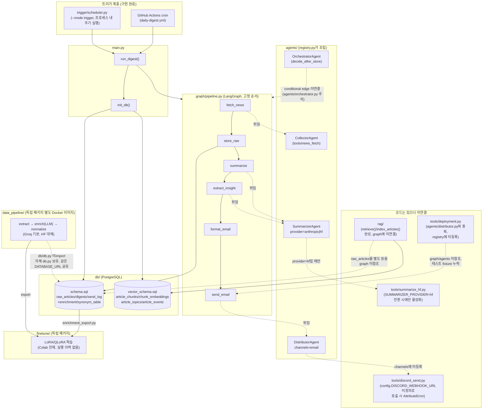

# BrieFYI 프로젝트 현황 리포트 (2026-08-18 기준)

스케줄러·에이전트·모델 파인튜닝·데이터 파이프라인·전체 실행 파이프라인·DB(벡터 스키마 포함)를
모듈별로 점검하고, 코드 통합이 필요한 부분과 모듈별 테스트 명령어를 정리한다. 아래 판단은 코드를
직접 읽고 로컬에서 테스트를 실행해 확인한 결과다(추정이 아닌 재현된 사실 위주로 표기).

## 1. 시스템 구조도 (현재 실제 연결 상태)

`docs/agentic-news-insight-system-design.md`의 5계층 설계 대비 **실제로 코드가 연결된 경로**만
실선으로, 코드는 있지만 아직 연결되지 않은 경로는 점선으로 표시했다.



## 2. 모듈별 현황

### 2.1 스케줄러 (`trigger/`) — 완성, 문제 없음

`Scheduler`/`Job`이 표준 라이브러리만으로 고정 주기·단일 스레드 순차 실행·예외 격리를 구현했고
`main.py --mode trigger`와 `python -m trigger` 양쪽에서 재사용된다. `tests/test_scheduler.py`가
가짜 시계로 주기·지연 시 건너뛰기·예외 격리를 검증하며, `RUN_SLOW_TESTS=1`일 때만 실제 10초 주기
통합 테스트가 돈다. 실행 확인 결과 **정상 동작**.

### 2.2 에이전트 (`agents/`) + 오케스트레이션 (`graph/pipeline.py`) — MVP 완성, 설계된 확장 포인트 존재

- `agents/registry.py`의 `build_agents()`가 provider/channel을 환경변수로 조립해 `graph/pipeline.py`에
  주입한다. 노드(`fetch_news_node` 등)는 전부 `agents["역할"].run(...)`에 위임하는 얇은 어댑터다.
- `agents/orchestrator.py`의 `decide_after_store()`는 "신규 기사 없으면 종료" 판단 로직까지
  구현돼 있지만, `graph/pipeline.py`는 여전히 `add_edge`(고정 엣지)만 쓰고 있어 **아직 그래프에
  연결되지 않았다**. 코드 주석에 연결 방법까지 명시돼 있어 확장 준비는 끝난 상태.
- `SummarizerAgent`는 `provider="hf"`로 전환 시 `tools/summarize_hf.py`를 쓰도록 분기 코드가 있으나,
  `registry.py`의 tools 딕셔너리에는 `summarize_hf`가 주석 처리(`# "summarize_hf": ...`)돼 있어
  현재는 `SUMMARIZER_PROVIDER=hf`로 바꿔도 실제로는 동작하지 않는다(등록 자체가 안 됨).

### 2.3 도구 (`tools/`) — 활성 경로와 미연결/결함 있는 경로가 혼재

| 파일 | 상태 |
| --- | --- |
| `news_fetch.py`, `llm_client.py`, `summarize.py`, `insight.py`, `email_format.py`, `email_send.py` | `agents/registry.py`에 등록되어 실제로 쓰이는 경로. 정상 |
| `hf_llm_client.py`, `summarize_hf.py` | 코드는 완성됐지만 위 2.2에서 설명한 대로 registry 미등록으로 미활성 |
| `discord_send.py` | **버그 확인**: `config.DISCORD_WEBHOOK_URL`을 참조하지만 `config.py`의 `Config` 클래스에 해당 속성이 없다. 직접 호출하면 의도한 `RuntimeError`(“.env 확인”)가 아니라 `AttributeError`가 난다. `agents/distributor.py`의 `channels`에도 `"discord"`가 등록돼 있지 않아 파이프라인에서 호출될 일도 없다(죽은 코드) |
| `deployment.py` | `agents/distributor.py`와 기능이 겹치는 별도의 이메일 배포 로직(수신자 목록을 `target_adress.json`에서 읽음). `graph/pipeline.py`·`agents/`·`main.py` 어디에서도 import되지 않는 고아 모듈. 유일한 사용처인 `tests/test_deployment.py`는 `unittest.TestCase`가 아닌 pytest 스타일 평문 함수라 리포지토리 표준 테스트 명령(`python -m unittest discover`)으로는 **아예 수집되지 않으며**, 필요한 `target_adress.json`/`test_text.json` 픽스처 파일도 저장소에 없어 pytest로 직접 돌려도 실패한다 |

### 2.4 DB (`db/`, 벡터 스키마 포함) — 스키마 설계는 탄탄하나 실행 환경이 스키마를 못 따라감

- `db/schema.sql`: `raw_articles`/`digests`/`send_log` (라이브 파이프라인) + `enrichment`/`synonym_table`
  (`data_pipeline/`용, `DEFAULT`로 기존 insert 경로와 호환) — 설계 문서와 일치, 정상.
- `db/vector_schema.sql`: `article_chunks`/`chunk_embeddings`/`article_topics`/`article_events` 등
  RAG용 스키마. `pgvector` 확장(`CREATE EXTENSION vector`)이 필요.
- **`db/db.py`의 `init_db()`가 `schema.sql`과 `vector_schema.sql`을 무조건 둘 다 적용한다**
  (`SCHEMA_PATHS` 튜플). 즉 pgvector 확장이 없는 Postgres에서는 `main.py`를 실행하는 순간
  `init_db()` 단계에서 실패한다. 이게 실제로 두 군데서 재현됐다:
  1. **로컬에서 현재 떠 있는 컨테이너(`briefyi-db-1`, image `briefyi-db:16`)가 구버전 이미지다.**
     `Dockerfile.db`는 이미 `pgvector/pgvector:pg16` 베이스로 올바르게 작성돼 있지만, 실행 중인
     컨테이너에는 `\dx` 확인 결과 `plpgsql`만 설치돼 있고 `vector` 확장이 없다 — Dockerfile.db를
     수정한 뒤 이미지를 재빌드하지 않은 상태. `docker compose build db && docker compose up -d db`
     (또는 `./scripts/db-up.sh --reset --force`)로 재생성해야 한다.
  2. **`.github/workflows/daily-digest.yml`이 `postgres:16-alpine`(pgvector 미포함)을 서비스
     컨테이너로 쓴다.** `rag/README.md`도 이미 이 문제를 인지하고 있다(“현재 GitHub Actions는
     pgvector가 없는 postgres:16-alpine을 사용… RAG node를 추가하기 전에도 현재 workflow는
     vector extension 단계에서 실패할 가능성이 있다”). 실제로 `init_db()`가 무조건 벡터 스키마를
     적용하므로, **지금 상태로 daily-digest 워크플로를 실행하면 매일 실패한다.** `Dockerfile.db`와
     같은 `pgvector/pgvector:pg16` 이미지로 교체하거나, `daily-digest.yml`의 `services.postgres`를
     그 이미지로 바꿔야 한다.
- 로컬 venv에는 `pgvector`(파이썬 패키지, `requirements.txt`에 명시됨)가 설치돼 있지 않다 →
  `rag/tests/test_db.py`, `test_indexer.py`, `test_pipeline.py`, `test_retriever.py` 4개 모듈이
  `ModuleNotFoundError: No module named 'pgvector'`로 import 자체가 실패한다.
- `pyproject.toml`(루트, `uv` 관리)의 `dependencies`에는 `psycopg`/`pgvector`가 빠져 있다.
  실제로는 `requirements.txt`를 별도로 설치해 맞춰둔 상태로 보이며, `uv sync`만 실행하면
  DB 관련 패키지가 없는 환경이 만들어질 수 있다.
- 저장소 루트의 `pipeline.db`(0바이트 SQLite 파일)는 PostgreSQL 전환 이전의 잔재로 보인다.
  현재 아무 코드에서도 참조하지 않는다 — 정리 대상.

### 2.5 RAG (`rag/`) — 기능은 완성, 설계상 아직 파이프라인에 미연결(의도된 상태)

`rag/README.md`가 이례적으로 자기 상태를 정확히 문서화해 두었다: `raw_articles → article_chunks →
chunk_embeddings → retrieve()`는 함수 단위로 완성돼 독립 실행 가능하지만, `graph/pipeline.py`나
digest 발송 흐름에는 아직 연결하지 않았다(의도적 — 검증 우선). 로컬 실행 시 `rag/tests` 중
4개 모듈은 위 2.4의 `pgvector` 패키지 누락으로 import 실패, 5개는 `beautifulsoup4` 누락으로
skip된다. `rag/README.md`가 명시한 통합 전 선결 조건(HF/GLiNER2 실패 격리, CI의 pgvector 이미지,
공유 requirements에 GLiNER2/torch 없음)은 아직 해소되지 않았다.

### 2.6 RAG 실험 (`rag_experiment/`) — 정리 대상 후보

`rag/`와 별개로 존재하는 25개 파일짜리 실험 디렉터리(`answer_rag.py`, `eval_*.py`,
`sbs_fetch.py` 등). git에 커밋돼 있지만 다른 어떤 `.py`/`.md` 파일에서도 참조되지 않는다.
`rag/README.md`의 “develop 브랜치의 data_pipeline을 따른다”는 서술과 파일 구성으로 볼 때
`rag/`의 전신 실험으로 보인다. 계속 유지할 계획이 없다면 `archive/`로 옮기거나 삭제해
루트를 정리하는 편이 좋다.

### 2.7 데이터 파이프라인 (`data_pipeline/`) — 독립 패키지로 잘 격리됨, 로컬 테스트 1건 실패(환경 설정 이슈)

`extract → enrich(LLM) → normalize`의 3단계, `pipeline_status` 컬럼 기반 재시작 가능 설계,
Groq 기본/HF 대체 provider, `rate_limiter.py`의 슬라이딩 윈도우 등 `docs/data-pipeline-design.md`와
코드가 정확히 일치한다. 별도 Docker 이미지·별도 `db.py`(레포 루트 `db/`를 import하지 않고 로직만
복제)로 컨테이너 독립성을 확보한 설계 의도도 코드에 반영돼 있다. `data-pipeline` 패키지는 현재
venv에 editable로 설치돼 있어 로컬에서 바로 테스트 가능:

```
1 failed, 26 passed — test_config.py::test_llm_provider_defaults_to_groq
```

실패 원인은 코드 버그가 아니라 **로컬 `.env`가 `DATA_PIPELINE_LLM_PROVIDER=hf`로 설정돼 있어**
"기본값은 groq"를 검증하는 테스트와 충돌하는 것이다. `.env`에 이 값이 있으면 항상 재현되므로,
CI처럼 `.env` 없이 돌리거나 테스트 격리(환경변수 초기화)를 추가하는 게 근본 해결책이다.

### 2.8 모델 파인튜닝 (`finetune/`) — 스캐폴드 완성, 실행 이력 없음, YAML 설정 파싱 버그 확인

`finetune/docs/WORKLOG.md`가 스스로 밝히듯 “스캐폴드만 생성된 상태, 첫 실행은 아직 없음”이다.
LoRA/QLoRA 학습·병합·추론·평가 코드, Colab 노트북, 데이터 소스 로더(`aihub`/`dacon`/
`digests_export`/`enrichment_export`)까지 구조는 갖춰져 있다. 현재 venv에서 `pytest finetune/tests`
실행 결과:

```
1 failed, 56 passed — test_config.py::test_load_full_config
TypeError: '<=' not supported between instances of 'str' and 'int'
```

**원인 확인**: `finetune/configs/*.yaml` 전 파일(`smoke.yaml`, `lora_bf16_7.8b.yaml`,
`qlora_*.yaml`)이 `learning_rate: 1e-4` / `2e-4` 형식을 쓰는데, PyYAML의 기본 리졸버는 소수점이
없는 지수 표기(`1e-4`)를 float가 아니라 **문자열로 파싱**하는 잘 알려진 동작이다. 그 결과
`finetune/src/summarize_ft/config.py:160`의 `cfg.train.learning_rate <= 0` 비교에서
`str <= int` 비교를 시도해 `TypeError`가 난다. **모든 학습 config가 동일하게 영향받으므로, 지금
상태로는 `python -m summarize_ft.train --config configs/smoke.yaml`(스모크 테스트 포함)이
config 검증 단계에서 즉시 실패한다.** 수정은 두 가지 중 하나: (a) YAML 값을 `1.0e-4`처럼 소수점을
포함한 표기로 바꾸거나, (b) `config.py`의 로더에서 `learning_rate = float(cfg.train.learning_rate)`로
명시적 캐스팅을 추가.

또한 `docs/lora-finetune-summarization-design.md`를 `finetune/README.md`·`finetune/docs/ARCHITECTURE.md`
두 곳에서 참조하지만, 실제 파일명은 `docs/LORA-F~1.MD`로 저장돼 있다(Windows 8.3 short-name 형태로
잘못 커밋된 것으로 보임). 같은 이유로 `agent-management-structure.md`를 가리키는 참조도
실제로는 `docs/AGENT-~1.MD`다. 두 참조 모두 현재는 깨진 링크다 — 파일명을 의도한 이름으로
되돌리는 간단한 수정으로 해결된다.

### 2.9 전체 실행 파이프라인 (`main.py`, `docker-compose.yml`, GitHub Actions) — 로컬 단일 실행은 정상, CI는 현재 깨짐

- `main.py`의 `single`/`trigger` 모드, 인자 파싱, 종료 코드 처리는 `tests/test_main_modes.py`로
  mock 검증돼 있고 로직상 문제 없음.
- `docker-compose.yml`은 `db`(pgvector 포함 빌드) + `digest`(1회 실행 잡) 구조로 설계는 맞다.
  다만 2.4에서 확인했듯 로컬 `db` 컨테이너가 재빌드되지 않아 실제로는 실행 시 실패한다.
- `.github/workflows/daily-digest.yml`은 2.4에서 확인한 대로 pgvector 미포함 이미지를 쓰고 있어
  **현재 상태로 스케줄이 돌면 `init_db()`에서 매번 실패한다.** 이게 이번 점검에서 나온 가장
  우선순위 높은 이슈다.

## 3. 코드 통합이 필요한 부분 (우선순위 순)

1. **[운영 차단] CI의 pgvector 미포함 이미지** — `daily-digest.yml`의 `services.postgres`를
   `pgvector/pgvector:pg16`으로 교체. 안 하면 스케줄 실행이 매번 실패한다.
2. **[운영 차단] 로컬 `briefyi-db-1` 컨테이너 재빌드** — `docker compose build db && docker compose up -d db`
   (또는 `./scripts/db-up.sh --reset --force`)로 `Dockerfile.db`의 pgvector 베이스 이미지 반영.
3. **[버그] `finetune/configs/*.yaml`의 `learning_rate` 문자열 파싱** — 모든 학습 config에 영향,
   스모크 테스트조차 config 검증 단계에서 실패. `config.py`에 `float()` 캐스팅 추가 권장.
4. **[버그] `tools/discord_send.py`의 `config.DISCORD_WEBHOOK_URL` 미정의** — `config.py`에 속성
   추가하고 `.env.example`에도 항목 추가. 현재는 `agents/distributor.py`의 `channels`에도 등록돼
   있지 않아 죽은 코드이므로, Discord 채널을 실제로 켤 계획이 있을 때 함께 정리.
5. **[정리] `tools/deployment.py` + `tests/test_deployment.py`** — `agents/distributor.py`와
   기능이 중복되는 고아 모듈. 실제 채택할 배포 방식(수신자 다중화가 필요하면 `deployment.py` 쪽
   로직을 `agents/distributor.py`에 흡수, 아니면 삭제)을 정하고, 테스트도 `unittest.TestCase`로
   바꾸거나 pytest로 전환해 실제로 CI에서 수집되게 해야 한다.
6. **[정리] 깨진 문서 참조 2건** — `docs/LORA-F~1.MD` → `docs/lora-finetune-summarization-design.md`,
   `docs/AGENT-~1.MD` → `agent-management-structure.md` (또는 각 문서가 실제로 참조하는 이름)로
   파일명 정정.
7. **[정리] `pyproject.toml`(루트) 의존성 목록 보강** — `psycopg`, `pgvector` 등 실제 런타임에
   필요한 패키지가 빠져 있어 `uv sync`만으로는 DB 관련 코드가 동작하지 않는 환경이 만들어진다.
   `requirements.txt`와 `pyproject.toml`을 하나로 통일하는 것을 권장.
8. **[정리] `pipeline.db`(빈 SQLite 파일) 삭제** — PostgreSQL 전환 이전 잔재, 현재 미참조.
9. **[정리] `rag_experiment/` 거취 결정** — `rag/`로 대체된 실험 디렉터리로 보임. 보존 목적이
   없다면 `archive/`로 이동하거나 삭제.
10. **[낮음] `data_pipeline` 테스트의 `.env` 의존성** — `test_llm_provider_defaults_to_groq`가
    로컬 `.env`의 `DATA_PIPELINE_LLM_PROVIDER` 값에 영향을 받는다. 테스트에서 환경변수를
    격리(fixture로 monkeypatch)하면 근본 해결.
11. **[설계 확장, 급하지 않음]** `agents/orchestrator.py`의 `decide_after_store`를
    `graph.add_conditional_edges`로 실제 연결, `agents/registry.py`에 `summarize_hf` tool 등록
    (주석 해제) — 둘 다 코드/문서에 연결 방법이 이미 명시돼 있어 필요 시점에 바로 진행 가능.

## 4. 모듈별 테스트 명령어

### 4.1 메인 파이프라인 / 트리거 / DB (루트, `unittest`)

```bash
# 사전 조건: DB 컨테이너 기동 (2.4의 이슈 해결 후)
docker compose up -d db   # 또는 ./scripts/db-up.sh

python -m unittest discover -t .                          # 전체 (tests/ + rag/tests/)
python -m unittest tests.test_scheduler                    # 스케줄러
python -m unittest tests.test_main_modes                   # main의 single/trigger 모드 (DB 불필요, mock)
python -m unittest tests.test_db_connection                # DB 접속 (URL 조립 + 실접속)
python -m unittest tests.test_db_crud                       # 테이블별 CRUD·제약·트랜잭션
python -m unittest tests.test_db                            # db.py 헬퍼 함수
RUN_SLOW_TESTS=1 python -m unittest tests.test_scheduler   # 실제 10초 주기 검증 포함 (약 21초)
```

### 4.2 RAG (`rag/`)

```bash
# 사전 조건: pgvector 파이썬 패키지 설치 (현재 누락)
uv pip install pgvector beautifulsoup4

python -m unittest discover -s rag/tests -t . -p "test_*.py"
```

### 4.3 데이터 파이프라인 (`data_pipeline/`)

```bash
uv pip install -r data_pipeline/requirements.txt
uv pip install -e data_pipeline/

pytest data_pipeline/tests

# 실제 실행 (DB + Groq API 키 필요)
python -m data_pipeline.cli run --stage all --limit 20
python -m data_pipeline.cli synonyms build
```

### 4.4 모델 파인튜닝 (`finetune/`)

```bash
cd finetune
bash scripts/setup.sh
python scripts/check_env.py
pytest tests                                                  # 1개 실패 (3.2절 참고, learning_rate 캐스팅 수정 전까지)
python -m summarize_ft.train --config configs/smoke.yaml      # 스모크 테스트 (현재 config 파싱 버그로 실패)
```

### 4.5 배포 도구 (`tools/deployment.py`) — 현재 리포지토리 표준 방식으로는 실행 불가

```bash
# tests/test_deployment.py는 pytest 스타일이라 unittest discover에 잡히지 않는다.
# pytest로 직접 실행해도 target_adress.json / test_text.json 픽스처가 저장소에 없어 실패한다.
# 3절 5번 항목(정리 방향 결정) 완료 전까지는 테스트 실행 불가 상태로 남겨둔다.
pytest tests/test_deployment.py   # 현재 FileNotFoundError로 실패
```

## 5. 요약

트리거·에이전트·핵심 도구 체인(뉴스 수집→요약→인사이트→이메일)과 데이터 파이프라인은
설계 문서와 코드가 잘 맞고 로컬 테스트도 통과한다. 반면 **벡터 확장이 없는 DB 이미지 때문에
CI(daily-digest.yml)가 현재 상태로는 매일 실패**하며, **finetune의 모든 YAML config가
`learning_rate` 파싱 버그로 스모크 테스트조차 못 돈다**. 이 두 가지가 가장 먼저 손대야 할
항목이고, 나머지(Discord 미연결, `deployment.py` 중복, 문서 링크 깨짐, `rag_experiment/` 정리)는
운영을 막지는 않지만 다음에 이 코드를 만지는 사람이 헷갈리지 않도록 정리해두는 게 좋다.
