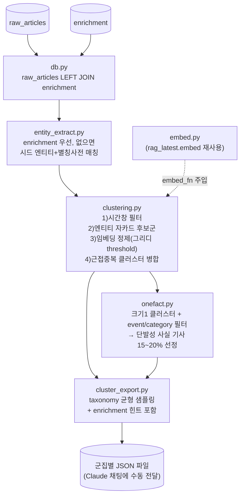

# `finetune/make_train_data/` 설계 — 군집 기반 인사이트 파인튜닝 학습 데이터 생성

## 0. 배경 및 목표

`finetune/docs/insight_finetune_design.md`(이하 "원 설계문서")는 여러 뉴스 기사를 클러스터링해 그 이면의 함의(전략적 의도, 모순/긴장, 선행지표, 이해관계자 영향, 시장 신호, 리스크/기회)를 추론하는 능력을 Qwen3-8B에 QLoRA로 학습시키기 위한 데이터 설계다. 원 설계문서의 2절(GNews API 수집 전략)은 "학습 데이터를 만들기 위해 GNews를 직접, 새로 수집한다"는 전제였지만, 지금은 `data_pipeline/`이 이미 `raw_articles`(+`enrichment`)에 기사와 1차 메타데이터를 쌓아두고 있으므로, 이 문서는 **원 설계문서의 3~5절(클러스터링·라벨 구성·분할 전략)을 "이미 DB에 있는 데이터"에 맞게 다시 설계**한다. 2절의 수집 전략과 6~9절(학습 실행·평가·리스크·로드맵)은 원 설계문서를 그대로 따르고 이 문서에서 재정의하지 않는다.

**이 문서가 다루는 범위**: `raw_articles`(+`enrichment`) → 클러스터링 → 단발성 사실 기사 선정 → 군집별 파일 생성까지.
**범위 밖 (수동 단계)**: 군집 파일을 Claude 채팅에 붙여넣어 질문/답변을 생성하는 것, 그 답변을 다시 학습용 JSONL로 변환하는 것. 원 설계문서 4절의 "Claude를 정답 생성자로 쓰는" 구조는 그대로 유지하되, API 자동 호출이 아니라 **사람이 파일을 Claude 채팅에 직접 전달하는 수동 워크플로**로 확정한다.

## 1. 아키텍처



`data_pipeline/`과 마찬가지로 레포 루트 `db/db.py`·`config.py`를 재사용한다(스키마 중복 정의 방지) — `finetune/src/summarize_ft/sources/*_export.py`가 이미 쓰는 `sys.path` 트릭(같은 레포 체크아웃 안에서 스크립트로 실행되는 걸 전제)을 그대로 따른다. `data_pipeline/`처럼 별도 Docker 이미지로 독립 배포할 필요는 없으므로 자체 `db.py`를 복제하지 않고 레포 루트 것을 직접 import한다.

## 2. 컴포넌트 명세

### 2.1 `config.py`

레포 루트 `.env`를 로드(`sys.path` 트릭으로 루트 `config.py` import). 새 환경변수:

| 변수 | 기본값 | 설명 |
|---|---|---|
| `MTD_NARROW_WINDOW_HOURS` | `72` | 시간창 1(같은 사건) |
| `MTD_BROAD_WINDOW_DAYS` | `28` | 시간창 2(같은 테마 흐름) |
| `MTD_ENTITY_JACCARD_THRESHOLD` | `0.3` | 2단계 후보군 임계값 |
| `MTD_EMBED_SIM_THRESHOLD` | `0.75` | 3단계 임베딩 정제 임계값 |
| `MTD_DEDUP_THRESHOLD` | `0.9` | 4단계 근접중복 병합 임계값 |
| `MTD_MIN_CLUSTER_SIZE` | `2` | 이 미만은 클러스터로 안 치고 단발성 후보로 넘김 |
| `MTD_ONEFACT_RATIO` | `0.175` | 전체 산출물 중 단발성 사실 기사 목표 비율(15~20%의 중앙값) |
| `MTD_MIN_ARTICLES` | `20` | 이 미만이면 클러스터링을 돌리지 않고 안내만 출력 |

### 2.2 `db.py`

```python
def fetch_articles(since: str | None = None) -> list[dict]:
    """raw_articles LEFT JOIN enrichment. enrichment가 없으면 관련 필드는 None.
    반환 필드: id, title, description, url, source, published_at,
               category, domain, entity, event, insights (enrichment 쪽, nullable)
    """
```

`enrichment`는 `LEFT JOIN`이다 — `pipeline_status='normalized'`가 아닌 기사(현재 76건 중 66건)도 클러스터링 대상에서 빠지면 안 되므로, `enrichment_export.py`(INNER JOIN + `normalized`만)와 달리 여기서는 모든 `raw_articles`를 대상으로 하고 enrichment 유무만 분기 신호로 쓴다.

### 2.3 `entity_extract.py`

```python
def extract(article: dict) -> tuple[list[str], str | None, list[str]]:
    """(entities, category, domains) 반환.
    article['entity']가 있으면(enrichment 완료) 그대로 사용.
    없으면 SEED_ENTITIES(시드 엔티티+별칭사전, 원 설계문서 2.2절 목록 기반: NVIDIA/엔비디아,
    OpenAI/오픈AI, Anthropic, Google/구글, Microsoft, Meta, TSMC, ASML, AMD, Samsung/삼성 등)를
    title+description에 문자열 매칭해 찾은 것만 반환한다 — 새 NER 의존성을 추가하지 않는다.
    """
```

### 2.4 `embed.py`

```python
def embed_texts(texts: list[str]) -> list[list[float]]:
    """rag_latest.embed.embed_texts()를 그대로 호출하는 얇은 래퍼.
    sys.path에 레포 루트를 추가해 rag_latest를 import한다(entity_extract.py와 같은 sys.path 트릭).
    """
```

### 2.5 `clustering.py`

순수 함수 위주로 작성해 `embed_fn`을 주입받는다(`data_pipeline/clustering.py`와 동일한 테스트 전략 — 실제 임베딩 모델 없이 결정론적 가짜 벡터로 단위 테스트).

```python
def cluster_articles(
    articles: list[dict],
    *,
    narrow_window_hours: float,
    broad_window_days: float,
    entity_jaccard_threshold: float,
    embed_sim_threshold: float,
    dedup_threshold: float,
    embed_fn: EmbedFn,
) -> list[Cluster]:
    """1~4단계를 순서대로 실행해 최종 클러스터 리스트를 반환한다.
    Cluster: cluster_id, window_type("narrow"|"broad"), articles, entities(합집합), event_type(최빈값)
    """
```

- **1단계 시간창 필터**: `published_at` 기준 좁은/넓은 윈도우 두 그룹으로 기사를 나눠 각각 독립적으로 2~4단계를 태운다(원 설계문서 3절 그대로).
- **2단계 엔티티 오버랩**: `entity_extract.extract()` 결과의 자카드 유사도로 1차 후보군 생성.
- **3단계 임베딩 정제**: `data_pipeline/clustering.py`의 그리디 threshold 클러스터링 패턴을 재사용(빈도 대신 "2단계 후보군 내에서"만 비교하도록 범위를 좁혀 적용) — title+description 임베딩 코사인 유사도.
- **근접중복 병합**(신규, 원 설계문서에 없던 추가 전략): 클러스터가 다 만들어진 뒤, 서로 다른 클러스터의 대표 임베딩(기사 임베딩 평균)끼리 `dedup_threshold` 이상이면 병합 — 같은 이슈가 며칠에 걸쳐 반복 보도돼 거의 동일한 클러스터가 여러 개 생기는 것을 억제.

**원 설계문서 3절의 4단계("LLM 검증/병합", Claude 자동 호출)는 이 파이프라인에서 자동화하지 않는다**(0절 스코프) — 위 근접중복 병합으로 대체한다. 대신 `cluster_export.py`가 만드는 파일의 `claude_prompt`에 "이 기사들이 정말 같은 사건/테마인지 먼저 확인하고, 아니면 어떻게 나눌지 판단한 뒤" 라는 지시를 포함시켜, 사람이 Claude 채팅에서 검증과 라벨 생성을 한 번에 받도록 한다. 정리하면 `clustering.py`의 자동 파이프라인은 **시간창 필터 → 엔티티 오버랩 → 임베딩 정제 → 근접중복 병합**의 4단계이며, 원 설계문서의 3단계(임베딩 정제)까지는 이름·순서가 같고 4단계만 내용이 다르다.

### 2.6 `onefact.py` (단발성 사실 기사 탐지·선정)

```python
def select_onefact_candidates(
    clusters: list[Cluster],
    unclustered_articles: list[dict],
    *,
    target_ratio: float,
    total_selected_size: int,
) -> list[dict]:
    """크기 1 클러스터 + 클러스터에 전혀 들지 못한 기사(unclustered)를 후보 풀로 삼고,
    enrichment.event/category가 "정기 발표성"이면 우선순위를 높여 target_ratio만큼 선정한다.
    최종 확정(no_strong_insight 여부)은 하지 않는다 — 선정만 하고, 실제 라벨은 4절 수동
    단계에서 Claude/사람이 정한다.
    """
```

`enrichment.event`는 `data_pipeline/`이 LLM으로 생성한 원시값을 `synonym_table`로 정규화한 값이라 고정된 enum이 아니다(dimension별 canonical_value가 데이터가 쌓이면서 늘어남). 따라서 `ROUTINE_EVENT_TYPES`는 코드 상수로 **작게 시작**한다(예: `{"실적발표", "제품출시", "일반사실"}`) — 실행 결과를 보고 `synonym_table`에 실제로 쌓인 canonical_value들과 맞춰 조정하는 것을 전제로 하며, 초기 목록이 완벽하지 않아도 된다(어차피 최종 라벨은 사람/Claude가 정하므로 이 상수는 "우선순위 힌트"일 뿐이다).

### 2.7 `cluster_export.py`

```python
def export_clusters(
    clusters: list[Cluster],
    onefact_articles: list[dict],
    *,
    out_dir: Path,
    taxonomy_balance: bool = True,
) -> list[Path]:
    """클러스터 1개당 파일 1개(JSON) + 단발성 기사는 몇 개씩 묶어 별도 파일로 저장.
    taxonomy_balance=True면 event_type 분포를 보고 특정 유형이 압도적으로 많을 때 일부를
    샘플링에서 제외해 균형을 맞춘다(원 설계문서 5절 골드셋 규칙을 학습셋 생성에도 적용).
    각 파일에는 article별 enrichment_hint(있으면)와 claude_prompt(스키마 명시 지시문)를 포함한다.
    """
```

## 3. 파일 스키마

```json
{
  "cluster_id": "c_2026-08-18_nvidia_supply",
  "window_type": "narrow",
  "no_strong_insight_hint": false,
  "entities": ["NVIDIA", "TSMC"],
  "event_type": "supply_chain",
  "articles": [
    {
      "title": "...", "description": "...", "source": "...",
      "published_at": "...", "url": "...",
      "enrichment_hint": {"insights": ["..."], "category": "...", "domain": ["..."]}
    }
  ],
  "claude_prompt": "다음 기사 묶음이 정말 같은 사건/테마를 다루는지 먼저 확인해줘. 다루지 않는다면 어떻게 나눠야 하는지 알려줘. 같은 사건/테마가 맞다면, facts/insights(전략적_의도|모순_긴장|선행지표|이해관계자_영향|시장_신호|리스크_기회 중 최소 2종 이상 시도, 억지로 6종 다 채우지 않음)/no_strong_insight를 판단해서 [스키마]로 답해줘. 추가로 이 클러스터에 대해 종합적 판단을 요구하는 테스트용 질문과 모범 답안도 하나 만들어줘."
}
```

`no_strong_insight_hint`는 `onefact.py`가 선정한 후보 파일에서만 `true`로 세팅되는 힌트일 뿐, Claude/사람의 최종 판단을 대체하지 않는다.

## 4. 에러 처리

- `MTD_MIN_ARTICLES`(기본 20) 미만이면 클러스터링을 시도하지 않고 `cli.py`가 "현재 raw_articles가 N건뿐입니다. data_pipeline을 더 돌려 데이터를 쌓은 뒤 다시 실행하세요" 안내 후 종료 코드 0으로 끝낸다(에러가 아니라 정상적인 "아직 이르다" 상태).
- 임베딩 API(HF Inference API) 실패는 `rag_latest.embed`가 이미 갖고 있는 예외/재시도 처리를 그대로 물려받는다 — `make_train_data`에서 별도로 감싸지 않는다.
- 개별 기사의 `entity_extract`가 빈 리스트를 반환해도(엔티티를 하나도 못 찾음) 파이프라인은 멈추지 않고 그 기사를 "엔티티 없음" 그룹으로 두어 2단계에서 자연스럽게 고립시킨다(→ 결과적으로 단발성 후보 풀로 흘러감).

## 5. 테스트

`data_pipeline/tests`와 같은 스타일 — DB·실제 임베딩 API 없이 순수 로직만 검증한다.

- `test_entity_extract.py`: enrichment 있는 경우 그대로 반환, 없는 경우 시드 매칭(별칭 포함, 대소문자/한영 혼용).
- `test_clustering.py`: 가짜 `embed_fn` 주입, 1~4단계 각각 독립적으로 + 통합 시나리오(시간창 다른 기사는 안 묶임, 엔티티 겹쳐도 임베딩 안 맞으면 3단계에서 걸러짐, 근접중복 병합이 실제로 두 클러스터를 하나로 합침).
- `test_onefact.py`: 크기 1 클러스터 선정, ROUTINE_EVENT_TYPES 우선순위, target_ratio 근사 달성.
- `test_cluster_export.py`: JSON 스키마 필드 존재, taxonomy 균형 샘플링이 실제로 쏠림을 완화하는지.

## 6. `cli.py`

```bash
python -m finetune.make_train_data.cli run --out-dir finetune/make_train_data/output --since 2026-08-01
```

## 7. 노트북 (`finetune/notebooks/make_train_data_colab.ipynb`)

기존 `qlora_qwen3_8b_colab.ipynb`(학습 전용)와 독립된 새 노트북. 흐름: 번들 업로드(`make_train_data` 코드 + 필요한 최소 의존성) → `.env`의 `DATABASE_URL`로 원격/로컬 DB 접속(로컬에서 Colab이 DB에 못 붙는 경우를 대비해 접속 정보를 셀에서 직접 입력받는 옵션 포함) → `run` 실행 → 생성된 군집 JSON 파일들을 zip으로 묶어 다운로드. 임베딩은 `rag_latest.embed`가 HF Inference API를 쓰므로 Colab의 GPU가 필수는 아니지만, 로컬 환경 준비가 안 됐을 때 편의상 쓸 수 있게 만든다.

## 8. 범위 밖 (Non-goals)

- Claude API 자동 호출 (군집 검증, 라벨 생성 모두 수동 채팅)
- Claude 답변을 학습 JSONL로 변환하는 스크립트 (다음 단계, 이번 설계 밖)
- `finetune/src/summarize_ft/schema.py`의 `TaskName`에 새 task 추가 (JSONL 변환 단계에서 함께 결정)
- 원 설계문서 2절(GNews 수집), 6~9절(학습 실행·평가·리스크·로드맵) 재설계
