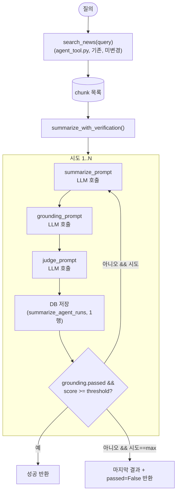

# `rag_latest/summarize_agent.py` 설계 — 검색 결과 요약 + grounding 검증 + LLM judge 재시도 루프

## 0. 배경 및 목표

`rag_latest/agent_tool.py`의 `search_news()`는 검색(hybrid retrieve + rerank)까지만 하고 생성(generation)은 하지 않는다 — RAG의 "R"(retrieval)만 있고 "G"(generation)가 없다. 이 문서는 `search_news()` 결과를 받아 **요약을 생성하고, 그 요약이 실제로 검색 결과에 근거하는지 검증하고, LLM-as-a-judge로 종합 점수를 매겨, 점수가 임계치 미달이면 재생성하는 루프**를 설계한다. 매 시도(attempt)는 DB에 개별 행으로 남는다.

## 1. 범위

- **포함**: `rag_latest/summarize_agent.py`(오케스트레이션), `rag_latest/prompts.py`(요약/검증/판정 프롬프트 3종), `rag_latest/llm_client.py`(Groq/Anthropic 스위처블 호출), `db/vector_schema.sql`에 `summarize_agent_runs` 테이블 추가, 루트 `config.py`에 `GROQ_API_KEY`/`GROQ_MODEL` 추가.
- **범위 밖**: `search_news()`/`retriever.py`/`reranker.py` 수정, 메인 다이제스트 파이프라인(`graph/pipeline.py`) 연동(추후 별도 결정 사항), 웹/CLI 프런트엔드.

## 2. 아키텍처



## 3. 컴포넌트 명세

### 3.1 `rag_latest/llm_client.py`

`data_pipeline/src/data_pipeline/llm_client.py`와 동일한 패턴(공용 `call_llm(system, user, max_tokens, provider)`, provider별 클라이언트 lazy 생성)을 최소 기능만 가져와 새로 만든다 — `data_pipeline/`을 import하지 않는다(별도 배포 이미지이므로). `groq`/`anthropic` 두 provider만 지원(`hf`는 이 용도에 불필요).

```python
def call_llm(system: str, user: str, *, max_tokens: int = 1500, provider: str | None = None) -> str:
    """provider 기본값은 config.RAG_SUMMARIZE_PROVIDER."""

def parse_json_response(text: str) -> dict | list:
    """```json 코드블록 우선, 없으면 첫 '{'/'['부터 raw_decode — llm_client.py(루트)/
    data_pipeline 것과 동일한 관용구."""
```

에러는 `LLMError(RuntimeError)`로 통일(다른 llm_client들과 동일).

### 3.2 `rag_latest/prompts.py`

세 프롬프트를 상수로 분리해 `summarize_agent.py`가 조합만 하게 한다(`tools/summarize.py`/`insight.py`처럼 시스템 프롬프트는 모듈 상수, JSON-only 응답 강제).

**`SUMMARIZE_SYSTEM_PROMPT`**: 질의 + chunk 목록(title/url/text/category)을 받아 질의에 답하는 요약문을 생성. 각 문장이 근거한 chunk의 `article_id`를 인용하도록 강제.
```json
{"summary": "...", "citations": [{"sentence": "...", "article_id": 123}]}
```

**`GROUNDING_SYSTEM_PROMPT`**: 요약문 + 원본 chunk를 대조해 각 문장이 실제로 근거가 있는지 판정(원 설계문서/`docs/agentic-news-insight-system-design.md`의 `grounding_check` tool 스펙과 동일 목적).
```json
{"passed": true, "issues": [{"sentence": "...", "reason": "근거 없음 | 과잉해석 | 사실과 다름"}]}
```
`issues`가 비어 있으면 `passed: true`. 하나라도 있으면 `passed: false`.

**`JUDGE_SYSTEM_PROMPT`**: 질의 + 요약문 + grounding 결과를 받아 0~100점 종합 평가. 평가 기준 4개(각 0~25점 배분을 프롬프트에 명시): 근거충실성(grounding 결과 반영), 질의 관련성, 완전성(핵심 정보 누락 없음), 간결성.
```json
{"score": 82, "reasoning": "...", "breakdown": {"grounding": 22, "relevance": 20, "completeness": 20, "conciseness": 20}}
```

### 3.3 `rag_latest/summarize_agent.py`

```python
@dataclass
class AttemptResult:
    attempt_number: int
    summary: str
    citations: list[dict]
    grounding_passed: bool
    grounding_issues: list[dict]
    judge_score: float
    judge_reasoning: str
    passed_threshold: bool  # grounding_passed and judge_score >= score_threshold — DB의 같은 이름 컬럼과 1:1 대응

@dataclass
class SummarizeResult:
    run_id: str  # uuid4
    query: str
    attempts: list[AttemptResult]  # 마지막 원소가 최종 채택 결과

    @property
    def final(self) -> AttemptResult:
        return self.attempts[-1]

    @property
    def passed(self) -> bool:
        """루프가 성공적으로 끝났는지 — final.passed_threshold와 항상 동일하다.
        별도 필드로 중복 저장하지 않고 계산 프로퍼티로 둬서 attempts와 어긋날 여지를 없앤다."""
        return bool(self.attempts) and self.final.passed_threshold


def summarize_with_verification(
    query: str,
    chunks: list[dict],
    *,
    max_attempts: int | None = None,     # 기본 config.RAG_SUMMARIZE_MAX_ATTEMPTS
    score_threshold: float | None = None,  # 기본 config.RAG_SUMMARIZE_SCORE_THRESHOLD
    provider: str | None = None,           # 기본 config.RAG_SUMMARIZE_PROVIDER
) -> SummarizeResult:
    """search_news()가 반환한 chunk 목록을 받아 요약->검증->판정 루프를 돌리고,
    매 시도를 db.save_agent_run()으로 즉시 기록한 뒤 SummarizeResult를 반환한다.
    grounding.passed and judge.score >= score_threshold 이면 즉시 종료.
    max_attempts에 도달하면 마지막 시도를 passed=False로 반환한다(예외를 던지지 않음).
    """
```

`chunks`가 빈 리스트면(검색 결과 없음) LLM을 호출하지 않고 `passed=False`, 빈 `attempts`로 즉시 반환한다.

### 3.4 `db.py` 추가 함수 (`rag_latest/db.py`)

```python
def save_agent_run(run_id: str, query: str, attempt: "AttemptResult", provider: str) -> None:
    """summarize_agent_runs에 1행 INSERT. attempt_number부터 judge_score까지 그대로 매핑."""
```

### 3.5 `db/vector_schema.sql` 추가

```sql
CREATE TABLE IF NOT EXISTS summarize_agent_runs (
    id BIGSERIAL PRIMARY KEY,
    run_id UUID NOT NULL,
    query TEXT NOT NULL,
    attempt_number INTEGER NOT NULL CHECK (attempt_number >= 1),
    summary TEXT NOT NULL,
    citations JSONB NOT NULL DEFAULT '[]',
    grounding_passed BOOLEAN NOT NULL,
    grounding_issues JSONB NOT NULL DEFAULT '[]',
    judge_score DOUBLE PRECISION NOT NULL CHECK (judge_score BETWEEN 0 AND 100),
    judge_reasoning TEXT,
    provider TEXT NOT NULL,
    passed_threshold BOOLEAN NOT NULL,
    created_at TIMESTAMPTZ NOT NULL DEFAULT now()
);

CREATE INDEX IF NOT EXISTS summarize_agent_runs_run_id_idx ON summarize_agent_runs (run_id);
```

### 3.6 `config.py`(루트) 추가

```python
    # Groq (rag_latest/summarize_agent.py 빌드/개발 단계 기본 provider. data_pipeline과
    # 같은 GROQ_API_KEY를 공유하되 모델명은 별도 변수로 둔다 — data_pipeline은 완전히
    # 별도 설정을 쓰므로 이름 충돌 없음)
    GROQ_API_KEY = os.getenv("GROQ_API_KEY", "")
    GROQ_MODEL = os.getenv("GROQ_MODEL", "llama-3.3-70b-versatile")

    # rag_latest/summarize_agent.py 루프 설정
    RAG_SUMMARIZE_PROVIDER = os.getenv("RAG_SUMMARIZE_PROVIDER", "groq")
    RAG_SUMMARIZE_MAX_ATTEMPTS = int(os.getenv("RAG_SUMMARIZE_MAX_ATTEMPTS", "3"))
    RAG_SUMMARIZE_SCORE_THRESHOLD = float(os.getenv("RAG_SUMMARIZE_SCORE_THRESHOLD", "70"))
```

`.env.example`에도 대응 항목 추가.

## 4. 에러 처리

- LLM 호출 실패(429/5xx 등)는 `llm_client.LLMError`를 그대로 전파한다 — 새로 재시도 로직을 만들지 않고, `data_pipeline/rate_limiter.py` 같은 별도 rate limiter도 이번 범위에서는 추가하지 않는다(Groq 무료 티어 한도 안에서 개발 단계 사용을 전제, 필요해지면 별도 태스크로 추가).
- `parse_json_response`가 JSON 파싱에 실패하면(모델이 스키마를 안 지킴) 그 시도를 `grounding_passed=False, judge_score=0, judge_reasoning="응답 파싱 실패"`로 기록하고 다음 시도로 넘어간다 — 루프 전체를 죽이지 않는다.
- DB 저장 실패는 예외를 그대로 전파한다(다른 `db.py` 함수들과 동일한 관례 — 조용히 삼키지 않음).

## 5. 테스트

- `llm_client.py`: `parse_json_response`의 코드블록/raw 케이스 (data_pipeline 것과 동일 방식으로 순수 함수 테스트).
- `summarize_agent.py`: `call_llm`을 mock해 (a) 1회차에 바로 통과, (b) 1회차 미달→2회차 통과, (c) `max_attempts` 소진 후 `passed=False` 반환, (d) 빈 chunk는 LLM 호출 없이 즉시 실패 반환, (e) grounding 실패는 judge 점수가 높아도 재시도되는지, (f) JSON 파싱 실패 시 루프가 죽지 않고 다음 시도로 넘어가는지.
- `db.py`: `save_agent_run`이 실제 DB에 행을 남기는 통합 테스트(기존 `tests/dbhelpers.py` 패턴 재사용, 테스트 종료 시 삭제).

## 6. 범위 밖 (Non-goals)

- `graph/pipeline.py`/메인 다이제스트에 연동 (이 에이전트를 어디서 어떻게 호출할지는 추후 결정)
- Groq 레이트리밋 전용 처리 (data_pipeline의 `rate_limiter.py` 같은 것은 필요해지면 별도 작업)
- 프롬프트 few-shot 예시 추가, 다국어 프롬프트 분리
