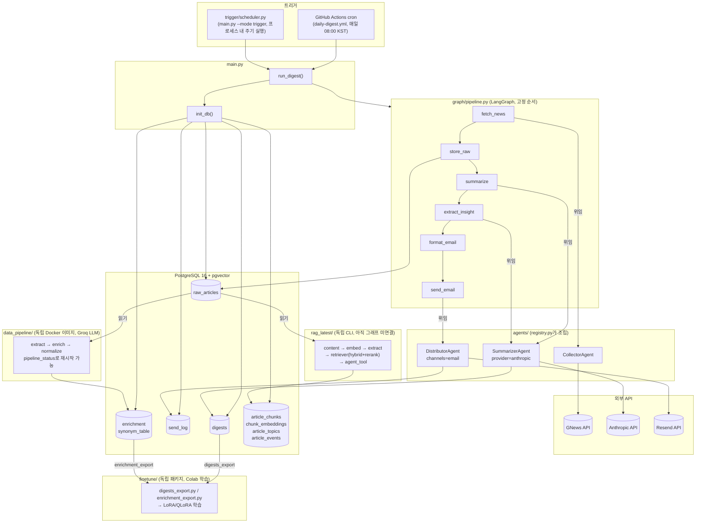
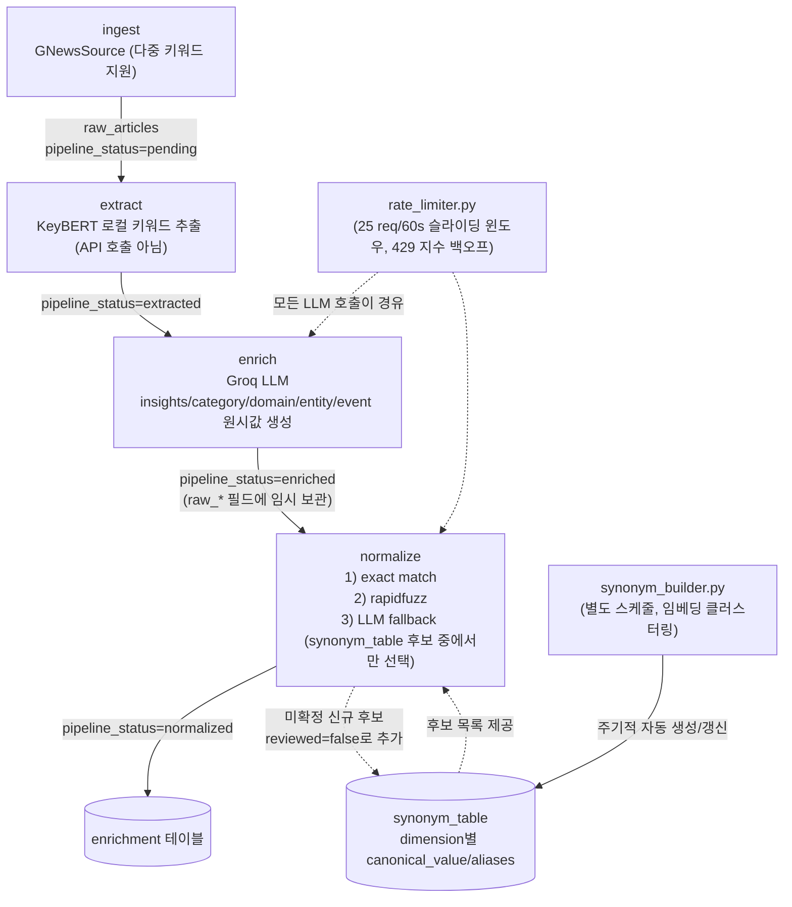
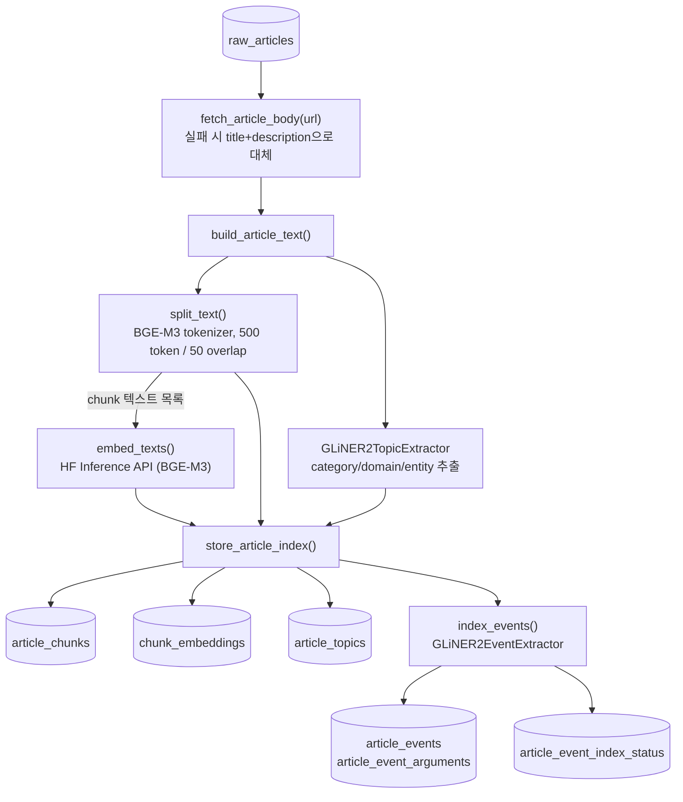
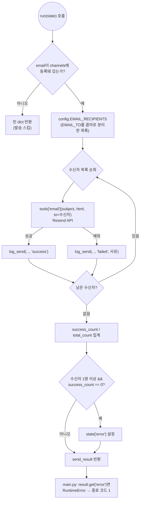
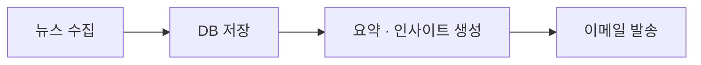
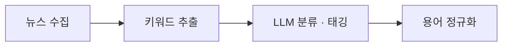

# BrieFYI 시스템 구조 (2026-08 기준)

`docs/agentic-news-insight-system-design.md`(초기 설계, 5계층 이상형)와 `docs/project-status-2026-08.md`(통합 이슈 점검 스냅샷)를 실제로 반영해 통합 수정을 마친 뒤의 **현재 코드 기준** 구조도다. 실행 시 실제로 도는 경로만 그리고, 코드는 있지만 아직 아무 데서도 호출하지 않는 경로(죽은 코드, 미연결 확장 지점)와 곧 삭제될 레거시 디렉터리는 구조도에서 뺐다 — 이유는 5절에 따로 정리했다.

## 1. 전체 구조도



## 2. 파이프라인별 상세 흐름

1절의 전체 구조도는 네 파이프라인이 어떻게 얽혀 있는지 보여주고, 여기서는 각 파이프라인 내부를 단계별로 펼친다.

### 2.1 메인 파이프라인 (`graph/pipeline.py`)

```mermaid
flowchart LR
    S(("시작")) --> N1["fetch_news"]
    N1 -->|GNews API| N2["store_raw"]
    N2 -->|"raw_articles\n(UNIQUE url, 중복은 무시)"| N3["summarize"]
    N3 -->|Anthropic API| N4["extract_insight"]
    N4 -->|"Anthropic API\ndigests 테이블 저장"| N5["format_email"]
    N5 -->|Jinja2 템플릿| N6["send_email"]
    N6 -->|"Resend API\n(배포 워크플로우, 2.4절)"| E(("종료"))
```



조건 분기 없는 고정 순서다. 노드 하나가 실패하면 `PipelineState.error`에 기록되고, `main.py`가 이를 보고 종료 코드를 결정한다(2.4절에서 이어지는 부분).

### 2.2 데이터 파이프라인 (`data_pipeline/`)



각 단계는 `raw_articles.pipeline_status`를 기준으로 어디까지 처리됐는지 판단하므로, 무료 API 환경에서 배치 중간에 끊겨도 다음 실행이 이어받는다. `extract`만 로컬 연산이고 `enrich`·`normalize`(LLM fallback 경로)는 외부 LLM 호출이라 `rate_limiter.py`를 거친다.

### 2.3 RAG 저장 파이프라인 (`rag_latest/indexer.py`)



본문 수집이 실패해도(사이트 차단, HTML 구조 차이 등) 해당 기사는 `title+description`으로 대체해 넘어가고, 전체 배치를 막지 않는다. 청킹(`split_text`)과 메타데이터 추출(`GLiNER2TopicExtractor`)은 원문 텍스트 하나에서 독립적으로 갈라져 나갔다가 `store_article_index()`에서 다시 합쳐져 한 트랜잭션으로 저장된다.

### 2.4 배포 워크플로우 (`agents/distributor.py`)



수신자별로 개별 발송·개별 로깅하므로 일부만 실패해도 나머지는 계속 보낸다. 다만 **전원** 실패했을 때만 `state["error"]`를 설정해 상위(`main.py`)로 실패를 알린다 — 그래야 `daily-digest.yml`이 "메일이 한 통도 안 나갔는데 CI는 초록불"인 상황 없이 실제로 실패로 표시된다.

## 3. 계층별 설명

### 3.1 트리거

- **GitHub Actions** (`.github/workflows/daily-digest.yml`): 매일 08:00 KST에 `python main.py`를 1회 실행하는 배치 트리거. 서비스 컨테이너로 `pgvector/pgvector:pg16`을 쓴다(`init_db()`가 벡터 스키마까지 무조건 적용하므로 pgvector 없는 이미지를 쓰면 매번 실패한다 — 과거 이슈였고 지금은 수정됨).
- **`trigger/scheduler.py`**: 표준 라이브러리만으로 구현한 고정 주기 스케줄러. `python main.py --mode trigger`로 진입하면 프로세스를 띄운 채 반복 실행한다(cron/GitHub Actions 없이 자체 호스트에서 돌릴 때 사용). 작업 예외는 격리되어 한 주기가 실패해도 다음 주기를 계속 돈다.

### 3.2 `main.py` → `graph/pipeline.py`

`main.py`가 `init_db()`로 스키마를 먼저 맞춘 뒤 `graph/pipeline.py`의 LangGraph `StateGraph`를 실행한다. 조건 분기 없는 고정 순서(`fetch_news → store_raw → summarize → extract_insight → format_email → send_email`)이며, 각 노드는 실제 로직을 직접 갖지 않고 `agents/registry.py`가 조립한 에이전트에 위임하는 얇은 어댑터다.

### 3.3 `agents/` + `tools/`

- **CollectorAgent**: `tools/news_fetch.py`로 GNews API를 호출한다.
- **SummarizerAgent**: `tools/summarize.py`(요약) + `tools/insight.py`(인사이트/시사점)로 Anthropic API를 호출하고, 결과를 `db.save_digest()`로 `digests` 테이블에 저장한다. `provider` 필드가 있어 향후 `finetune/`이 배포한 자체 모델(HF Inference API)로 전환할 수 있게 설계돼 있지만, 현재는 `anthropic` 하나만 실제로 등록돼 있다(5.2절).
- **DistributorAgent**: `config.EMAIL_RECIPIENTS`(콤마로 구분한 다중 수신자)를 순회하며 `tools/email_send.py`로 Resend API를 호출하고, 수신자별 성공/실패를 `db.log_send()`로 `send_log`에 남긴다. 전원 발송 실패 시 `state["error"]`를 설정해 `main.py`가 종료 코드 1을 반환하게 한다(트리거·CI가 실패를 감지할 수 있는 지점).

### 3.4 DB (PostgreSQL 16 + pgvector)

`db/db.py`의 `init_db()`가 `db/schema.sql`(운영 테이블: `raw_articles`/`digests`/`send_log` + `data_pipeline`용 `enrichment`/`synonym_table`)과 `db/vector_schema.sql`(RAG용: `article_chunks`/`chunk_embeddings`/`article_topics`/`article_events` 등)을 앱 시작 시마다 idempotent하게 적용한다. 위 다이어그램의 모든 테이블이 실제로 이 DB 하나에 존재한다.

## 4. DB로만 연결된 독립 서브시스템

아래 셋은 메인 다이제스트 요청 경로(2.1, 3.2~3.3)의 일부가 **아니다** — 각자 별도 실행 진입점을 가진 독립 파이프라인이며, 같은 PostgreSQL을 공유해서 데이터를 주고받을 뿐이다.

- **`data_pipeline/`**: 별도 Docker 이미지·별도 `db.py`(레포 루트 `db/`를 import하지 않고 로직만 복제)로 완전히 독립 배포된다. `raw_articles`를 읽어 Groq LLM(기본값, API 비용 없는 무료 티어)으로 `insights`/`category`/`domain`/`entity`/`event`를 뽑고, fuzzy match 우선 + LLM fallback으로 정규화해 `enrichment`/`synonym_table`에 쓴다. 목적은 `finetune/`의 학습 데이터 볼륨을 늘리는 것.
- **`finetune/`**: `db/db.py`의 `digests`(라이브 파이프라인 산출물)와 `data_pipeline`의 `enrichment`를 각각 `digests_export.py`/`enrichment_export.py`로 JSONL로 뽑아 학습 데이터로 합친 뒤 Colab에서 LoRA/QLoRA로 학습한다. 아직 실제 학습 실행 이력은 없다(스캐폴드 완성 단계).
- **`rag_latest/`**: `raw_articles`를 읽어 본문 청킹 + BGE-M3 임베딩(HF Inference API) + GLiNER2 4-Layer 메타데이터·구조화 이벤트를 뽑아 `article_chunks`/`chunk_embeddings`/`article_topics`/`article_events`에 쓰고, vector/text/hybrid 검색 + cross-encoder 재정렬 + LLM tool-use 검색 래퍼(`agent_tool.py`)까지 제공한다. `python -m rag_latest.cli`로 독립 실행하며, `graph/pipeline.py`는 아직 이 패키지를 import하지 않는다.

## 5. 구조도에서 제외한 것

### 5.1 `rag/`, `rag_experiment/` — 완전히 제외

두 디렉터리 모두 저장소에는 남아 있지만, `rag_latest/`가 이 둘을 통합해 대체하는 목적으로 새로 만들어졌고 원본은 사용자가 나중에 직접 삭제할 예정인 **읽기 전용 참고 자료**다. 현재 시스템의 어떤 실행 경로도 이 둘을 import하지 않는다. `rag/`는 `rag_latest/`의 뼈대가 된 이전 버전, `rag_experiment/`는 그보다 앞선 실험(별도 flat 테이블·별도 DB·`psycopg2` 사용, 지금 스키마와 호환 안 됨)이다.

### 5.2 코드는 있지만 아직 아무것도 호출하지 않는 확장 지점

전부 의도적으로 준비만 해둔 상태이며, 구조도에 넣으면 "지금 실행되는 흐름"과 "앞으로 켤 수 있는 옵션"이 섞여 오히려 헷갈린다.

| 코드 | 상태 |
| --- | --- |
| `tools/summarize_hf.py`, `tools/hf_llm_client.py` | `SummarizerAgent`가 `provider="hf"`를 받으면 쓰도록 분기까지 있지만, `agents/registry.py`의 tools 딕셔너리에 `summarize_hf`가 주석 처리돼 있어 `SUMMARIZER_PROVIDER=hf`로 바꿔도 실제로는 동작하지 않는다. `finetune/`이 모델을 배포한 뒤 등록할 자리. |
| `tools/discord_send.py` | Discord Webhook 발송 자체는 완성돼 있고 설정 버그도 수정됐지만, `DistributorAgent`의 `channels`에 `"discord"`가 등록돼 있지 않아 호출되지 않는다. |
| `agents/orchestrator.py`의 `decide_after_store` | "신규 기사 없으면 종료" 판단 로직은 구현돼 있지만 `graph/pipeline.py`가 여전히 고정 엣지만 써서 그래프에 연결돼 있지 않다. 검증 게이트를 추가하는 다음 단계에서 `add_conditional_edges`로 붙일 자리. |

## 6. 실행·테스트 명령 요약

```bash
# 메인 파이프라인
docker compose up -d db                    # 또는 ./scripts/db-up.sh
python main.py --keyword "AI" --days 1      # single 모드 1회 실행
python main.py --mode trigger --interval 3600   # 프로세스 내 주기 반복

# 테스트 (반드시 아래처럼 스위트별로 따로 실행 — data_pipeline/finetune를 한 pytest 호출에
# 같이 넘기면 동일 이름의 tests 패키지가 충돌해 수집 자체가 실패한다)
python -m unittest discover -t .                                    # 루트 + rag/tests
python -m unittest discover -s rag_latest/tests -t . -p "test_*.py"  # rag_latest
python -m pytest data_pipeline/tests -q
python -m pytest finetune/tests -q

# 독립 서브시스템
python -m data_pipeline.cli run --stage all --limit 20
python -m rag_latest.cli run --keyword AI --days 1 --device cpu
python finetune/scripts/prepare_data.py --sources enrichment digest_pipeline
```

## 7. 발표용 간략 흐름도

2절의 상세 흐름도에서 테이블명·API명·분기 조건을 걷어내고 "무엇을 하는가"만 남긴 버전이다. 청중에게 각 파트가 하는 일을 한눈에 보여줄 때 쓴다.

### 7.1 메인 파이프라인



### 7.2 데이터 파이프라인



### 7.3 RAG 저장 파이프라인


### 7.4 배포 워크플로우


